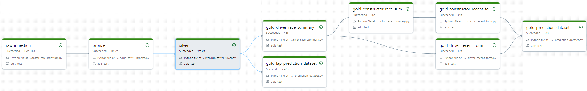

# 🏎️ Motorsport Data Platform

## What this project is about  

This project is an end-to-end Data Engineering and Machine Learning platform built on top of FastF1 data and deployed on Databricks with Azure Data Lake.

The objective is to predict a driver’s lap time at the start of a lap, using only the information available at that moment. The focus is on building a realistic, production-like pipeline rather than just a standalone model.

---

## Architecture  

The platform follows a Medallion Architecture (Bronze → Silver → Gold) to ensure a clear separation between raw data, cleaned data, and analytical datasets.

A Databricks workflow orchestrates the full pipeline from ingestion to feature generation.

### Bronze  
- Data ingested directly from the FastF1 API  
- Stored in Azure Data Lake in Delta format  
- Minimal transformation (normalization and metadata)  
- Partitioned by season and race  

### Silver  
- Cleaned and structured lap-level dataset  
- Joins between laps, lap weather, and results  
- Consistent schema and data types  
- One row represents one driver lap  

### Gold  

**Analytical Gold**  
- Driver and constructor race summaries  
- Used for analysis and exploration  

**ML Gold (core dataset)**  
- Final dataset used for modeling  
- One row represents a driver at lap L  
- Target is the lap time of that lap  

---

## Data Pipeline (Databricks)

The entire pipeline is executed as a Databricks job:

- Raw ingestion from FastF1  
- Bronze transformation  
- Silver data processing  
- Gold dataset generation  

Data is stored in Azure Data Lake using Delta tables.

The ingestion handles API limitations through caching and is designed to process multiple seasons and races in a scalable way.

---

## Machine Learning Problem  

The goal is to estimate lap time at the moment a new lap starts.

This is a time-series regression problem where only historical and current context information can be used.

---

## Features  

**Previous lap performance**  
- last_lap_time_ms  
- avg_lap_time_last_2  
- avg_lap_time_last_3  

**Tyre and race context**  
- compound  
- tyre_life  
- stint  
- fresh_tyre  

**Track conditions**  
- is_green  
- is_yellow  
- is_safety_car  
- is_vsc  
- is_red_flag  

**Weather**  
- track_temp  
- air_temp  
- humidity  
- wind_speed  
- pressure  

---

## Data Leakage  

Special care was taken to avoid data leakage:

- Only past laps and information known at lap start are used  
- No future or outcome-based data is included  

This ensures that the model reflects a realistic real-time prediction scenario.

---

## Current State  

- Full Medallion pipeline implemented  
- Pipeline running end-to-end on Databricks  
- Data stored in Delta format on Azure Data Lake  
- Lap-level dataset prepared for machine learning  
- Time-series feature engineering completed  
- Gold datasets available for analysis and modeling  

---

## Next Steps  

- Train regression models (Linear Regression, Random Forest)  
- Use time-based data splits  
- Evaluate performance using MAE and RMSE  
- Track experiments with MLflow  
- Deploy predictions through a FastAPI service  
- Add monitoring and retraining capabilities  

---

## Goal  

The goal is to build a system that can estimate lap times in real time based on driver performance, tyre condition, race situation, and environmental factors.

---

## Why this project  

This project demonstrates:

- Building scalable data pipelines using Databricks and Delta Lake  
- Applying Medallion architecture in a real use case  
- Designing time-series features with attention to leakage  
- Structuring an end-to-end pipeline from ingestion to modeling  
